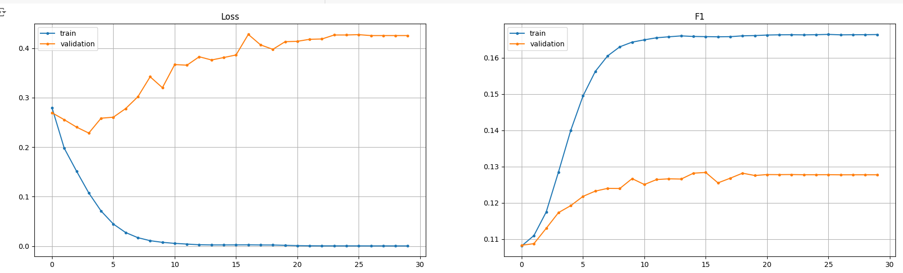

# NLP: Named Entity Recognition (NER)

### Named-entity recognition task (Ukrainian). PyTorch. Models: GRU; RNN; LSTM. Highly imbalanced.

## **Table of contents** 

1. [Introduction](#introduction)
    * [Project's objective](#projects-objective)
    * [The environment used](#the-environment-used)
        * [Limitations](#limitations)
    * [Choice behind the framework](#choice-behind-the-framework)
        * [Tensorflow](#tensorflow)
        * [PyTorch](#pytorch)
        * [Chosen framework](#chosen-framework)
    * [Technologies used](#technologies-used)
2. [Data description](#data-description)
    * [Credits to the dataset author](#credits-to-the-dataset-author)
3. [Data loading and visualization](#data-loading-and-visualization)
4. [Data preprocessing](#data-preprocessing)
    * [Consistency in sequence sizes](#consistency-in-sequence-sizes)
    * [Word encoding and padding (input)](#word-encoding-and-padding-input)
    * [Target padding](#target-padding)
5. [Class imbalance](#class-imbalance)
6. [Metrics choice](#metrics-choice)
7. [Model selection](#model-selection)
8. [Loss function choice](#loss-function-choice)
9. [Optimizer choice](#optimizer-choice)
10. [Data representation](#data-representation)
11. [Implementation strategy (PyTorch)](#implementation-strategy-pytorch)
12. [Initial parameters](#initial-parameters)
    * [Learning rate](#learning-rate)
    * [Number of epochs](#number-of-epochs)
    * [Batch size](#batch-size)
13. [Model training](#model-training)
    * [Choosing the best model](#choosing-the-best-model)
    * [Learning rate scheduler addition, analysis, tuning](#learning-rate-scheduler-addition-analysis-tuning)
    * [Summary on approaches used](#summary-on-approaches-used)
    * [Tuning the learning rate schedulers further](#tuning-the-learning-rate-schedulers-further)
    * [Batch size tuning](#batch-size-tuning)
    * [Changing the best model complexity](#changing-the-best-model-complexity)
    * [Summary on model training scores and params](#summary-on-model-training-scores-and-params)
14. [Best model training, saving and testing](#best-model-saving-and-testing)
15. [Improvements](#improvements)
16. [Conclusion](#conclusion)
17. [Project files' description](#project-files-description)
18. [About author](#about-author)
19. [References](#references)

## Introduction
Named-entity recognition task that involves a dataset of Ukrainian sentences with different entities. The models that are being tested are simple versions of GRU, RNN, LSTM.

### Project's objective
The objective of the project is to build an NER-model using Python and PyTorch while maximizing the accuracy of getting each entity class as accurate as possible using one of the specified models (GRU / RNN / LSTM) using the [benjamin/ner-uk](https://github.com/lang-uk/ner-uk/tree/master) dataset.

### The environment used
The problem being researched would take a vast amount of time per training if I didn't choose a platform with available GPU resources. The decision of using the Google Colab environment was made due to its simplicity, convenience and speed (at the time of selection).

#### Limitations
We are limited in terms of GPU per week (dynamically) by the Colab platform. Additionally, the system tends to terminate long-run sessions (multiple-epoch trainings) or freezes when the tab is inactive; although it is [specified](https://research.google.com/colaboratory/faq.html) to be able to run for 12 hours at a time. It restricts the RAM usage as well, meaning the complex models and bigger batch size trainings will fail with a "CUDA OUT OF MEMORY ERROR".

More details: [Colaboratory Frequently Asked Questions](https://research.google.com/colaboratory/faq.html)

### Choice behind the framework
The most popular frameworks for Data Science and Machine Learning are the two prominent options: `TensorFlow` and `PyTorch`. While both frameworks continue to evolve, each possesses its own set of advantages and disadvantages.

#### Tensorflow
Having had an experience in both frameworks while learning, `Tensorflow` has often encountered challenges in ensuring reproducibility (at least on CUDA). Additionally, implementing changes at various stages proved to be harder to implement, less intuitive and user-friendly compared to `PyTorch`'s.

It is considered, however, that `Tensorflow` fits production and scalable projects more; moreover, it is preferred for models' deployment on mobile devices and has a larger community due to being older than `PyTorch`.

#### PyTorch
On the contrary, `PyTorch` is more suitable for flexibility and research, utilizing the same functionality within multiple projects and have a complete reproducibility, which is crucial for any Machine Learning project (for instance when determining a single augmentation to be applied, we would need to perform only one training). There is also a plethora of native features that `PyTorch` provides and `Tensorflow` doesn't: various loss functions, optimizers with complicated set-ups and metrics, data loaders and custom samplers within their native OOP mechanics.

#### Chosen framework
Given the preference for exploring new ideas and ensuring reproducibility on GPU; being a student, researcher, constantly trying new ideas, I have given my preference to `PyTorch`. (`Tensorflow` does have reproducibility on Cuda in the experimental module, but it leads to slowing the process down and makes it indiscernible from CPU operations in terms of model training, making it meaningless to utilize parallel evaluations as such).

---
`P.S.:` My perception is limited and biased, I was taught this way and inherited not only knowledge, but the spirit of my teacher whom I sincerely adore.

### Technologies used
All of the instruments used are popular and well-known. I suggest we look at them as a code for convenience:

```python
import sys  # System-specific parameters and functions
from typing import List, Tuple, Mapping  # Type hinting for better code readability

import datasets # Import datasets library for getting various datasets to practice
from tqdm import tqdm  # Progress bar library for iterations
import numpy as np  # NumPy for numerical operations
import matplotlib.pyplot as plt  # Plotting library for visualizations

import torch  # Import PyTorch
import torch.nn as nn  # Neural network module
import torch.optim as optim  # Optimizer module from PyTorch for model training
import torch.nn.functional as F  # Functional operations like activation functions and loss calculations

# Importing padding utility for sequence data
from torch.nn.utils.rnn import pad_sequence  # pad_sequence for padding sequences in RNNs
# Dataset and DataLoader for efficient data handling and batching
from torch.utils.data import Dataset, DataLoader  
```

## Data description
The data is a set of sentences in Ukrainian with different entities; labeled. They are represented within the dataset library. Its columns are:
- tokens - represents the sentences in their original form
- ner_tags - labels for each entity according to the general convenient practice:


### Credits to the dataset author
The dataset itself is <b>"benjamin/ner-uk"</b> and I really appreciate the author's efforts for providing one completely free. If you'd like to reach out or explore this dataset, you can follow these links:

- [benjamin/ner-uk (HuggingFace)](https://huggingface.co/datasets/benjamin/ner-uk)
- [benjamin/ner-uk (GitHub)](https://github.com/lang-uk/ner-uk/tree/master)

## Data loading and visualization
Before proceeding to working with the dataset, we should look at it and obtain some basic information. Issues having been addressed:
```python
# !pip install datasets > /dev/null # if necessary
dataset = datasets.load_dataset("benjamin/ner-uk")
print(dataset)
```
#### Output:


Visualizing a random sample:
```python
print(dataset['train'][22])
```
#### Output:
```python
{'tokens': ['Натомість', 'представництва', 'іноземних', 'корпорацій', 'не', 'могли', 'відверто', 'надавати', 'підтримку', 'України',
  ',','оскільки','більшість','з','них','робить','бізнес','і','в','Росії','.'],
 'ner_tags': [0, 0, 0, 0, 0, 0, 0, 0, 0, 5, 0, 0, 0, 0, 0, 0, 0, 0, 0, 5, 0]}
```

### Consistency in sequence sizes
Since our sentences are of different lengths and models expect consistent inputs, we ensure consistency creating a padding token that will fill out any leftover missing symbols in the sequence.
```python
TOK_PAD_ID = 0  # Define a token ID for padding input sequences.
```

The chosen number also indicates that this is a 0-index word, meaning 'there is no such word'. See [word encoding and padding input](#word-encoding-and-padding-input) for details.

## Data preprocessing
### Word encoding and padding (input)
One of the simplest way to encode a text sequence is word or token encoding, when we simply take each unique word and add it to the vocabulary (dictionary) that is one for the dataset. Each word gets its unique index starting from `1` (this is why the padding token is `0`). With this approach, we can repeat words by just specifying the respective index and make sequences we need.

```python
vocab = {"<PAD>": TOK_PAD_ID}  # token ID will be used later when processing sequences to pad them to a consistent length
# (the actual padding of sequences occurs during data preprocessing when you convert the text sequences to numerical sequences and create batches for training)
curr_idx = 1

# Iterate through dataset splits (train, validation, test).
for split in ("train", "validation", "test"):
    for sample in dataset[split]:
        # Iterate through words (tokens) in the sample.
        for word in sample["tokens"]:
            # Check if the word is not already in the vocabulary.
            if word not in vocab:
                vocab[word] = curr_idx  # Add the word to the vocabulary with the current index.
                curr_idx += 1  # Increment the current index.

print("Vocab size:", len(vocab))
```
#### Output:
```python
Vocab size: 50205
```

### Target padding
As we now have nonexistent inputs, we have to create the respective targets for them:
```python
NER_PAD_ID = -100

# Initialize an empty set to store NERs (targets)
targets = set()

for split in ("train", "validation", "test"):
    for sample in dataset[split]:
        targets.update(sample["ner_tags"]) # Update the 'targets' set with NER tags from the current sample.

# Sort the unique NER tags
targets = sorted(targets)
print("Unique targets:", len(targets))
print(targets)
```
#### Outputs:
```
Unique targets: 9
[0, 1, 2, 3, 4, 5, 6, 7, 8]
```

We use a different number from the <b>'TOK_PAD_ID'</b> for the model not to confuse them with each other. That would lead to the incorrect loss computations. Choosing a value within the scale of ours can also mislead the model, so we pick the negative value of <b>-100</b> - the only one as such. Specifically, loss functions often (if not always) have an additional parameter of <b>'ignore_index'</b> not to include it in the computations.

### Class imbalance
Later in the code, we can print out the amount of padded indexes and the actual vocabulary:
```python
# Count the number of TOK_PAD_ID tokens in the training dataset after padding
tok_pad_count = 0
non_tok_pad_count = 0

# Create a DataLoader for the training dataset
train_loader = DataLoader(train_dataset, batch_size=32, collate_fn=ner_collate_fn)

for x_batch, _ in train_loader:
    # Count the occurrences of TOK_PAD_ID and non-TOK_PAD_ID in the padded batch
    tok_pad_count += (x_batch == TOK_PAD_ID).sum().item()
    non_tok_pad_count += (x_batch != TOK_PAD_ID).sum().item()

print(f"Number of TOK_PAD_ID tokens in the training dataset: {tok_pad_count}")
print(f"Number of NON-TOK_PAD_ID tokens in the training dataset: {non_tok_pad_count}")
```

#### Output:
```
Number of TOK_PAD_ID tokens in the training dataset: 438371
Number of NON-TOK_PAD_ID tokens in the training dataset: 202073
```

Talking about class imbalance, we should inspect the amount of all other classes we have:
```python
# Initialize a dictionary to hold the count of each class in the dataset
counts = {cls: 0 for cls in targets}

# Iterate over batches in the training data loader
for x_batch, _ in train_loader:
    # For each class in the defined targets
    for cls in targets:
        # Count occurrences of the class in the current batch and update the counts dictionary
        counts[cls] += (x_batch == cls).sum().item()

# Print the counts of each class
print(counts)
```
#### Outputs:
```
{0: 438371, 1: 6, 2: 18797, 3: 1999, 4: 13, 5: 6, 6: 24, 7: 6, 8: 8}
```

As we see, there is a strong class imbalance towards all padding tokens. The dataset is imbalanced and doesn't have enough data for the `1`, `4`, `5`, `6`, `7` and `8`th classes.

We could add and search for new data, change approaches, but the goal had been set. Let us do our best with it. This leads us to the next section.

## Metrics choice
Due to the mentioned above [imbalance](#class-imbalance) problem, the target metric must reflect how many classes we have identified correctly (precision) and how many of them have been left unidentified (recall). Consequently, the harmonic mean composes our metric - <b>F1-score</b>.

## Model selection
The models that are studied are: [GRU](https://pytorch.org/docs/stable/generated/torch.nn.GRU.html), [RNN](https://pytorch.org/docs/stable/generated/torch.nn.RNN.html#rnn), [LSTM](https://pytorch.org/docs/stable/generated/torch.nn.LSTM.html). All of them are strong in handling sequential data and retaining the information over long sequences.

- `RNN`: the first of the recurrent type, encounters the vanishing gradient problem (picked for studying purposes);
- `GRU` (Gated Recurrent Unit): the faster version of RNN; deals with the vanishing gradients problem;
- `LSTM` (Long Short-Term Memory): has a more complex architecture with three gates (input, forget, and output gates) and a cell state, more parameters, therefore longer training time.

The simplicity of the specified models is explained by the [limitations](#limitations).

## Loss function choice
`Cross-Entropy Loss` - suitable for multi-class classification tasks where each token belongs to exactly one class. The goal of this project is to experiment with models, so no other loss functions are considered this time.

## Optimizer choice
`Adam`, as a state-of-art optimizer, fits almost in any case: adaptive learning rate, efficiency, low memory requirements, ease of use. As it was mentioned, the goal of this project is to experiment with models, so no other optimizer functions considered this time.

## Data representation
A single item within the dataset is represented as follows:
- First element of the tensor (long) is an encoded sequence; padded with `TOK_PAD_ID`;
- Second element of the tensor (long) is padded with the `NER_PAD_ID` sequence of targets (from `1` to `9`).

```python
class NERDataset(Dataset):
    def __init__(self, samples: datasets.Dataset, vocabulary: Mapping[str, int]) -> None:
        """
        Initialize a Named Entity Recognition (NER) dataset.

        Args:
            samples (datasets.Dataset): The dataset containing samples with tokens and NER tags.
            vocabulary (Mapping[str, int]): A mapping from tokens to their corresponding indices.
        """
        self.samples = samples  # Store the input samples dataset.
        self.vocabulary = vocabulary  # Store the vocabulary for token-to-index mapping.

    def __len__(self) -> int:
        """
        Get the number of samples in the dataset.

        Returns:
            int: The total number of samples in the dataset.
        """
        return len(self.samples)  # Return the length of the samples.

    def __getitem__(self, index: int) -> Tuple[torch.LongTensor, torch.LongTensor]:
        """
        Retrieve a sample and its corresponding NER tags by index.

        Args:
            index (int): The index of the desired sample.

        Returns:
            Tuple[torch.LongTensor, torch.LongTensor]: A tuple containing token indices and NER tags.
        """
        sample = self.samples[index]  # Get the sample at the specified index.

        # Convert tokens to their corresponding indices using the vocabulary.
        doc = torch.LongTensor([self.vocabulary[token] for token in sample["tokens"]])  
        # Convert NER tags to a tensor of Long values.
        label = torch.LongTensor(sample["ner_tags"])

        return doc, label  # Return the token indices and NER tags for the sample.
```

## Implementation strategy (PyTorch)
First of all, we are fixing the `seed` to `42`. This is what helps us actually compare the performance of the model while running only a single time per experiment.

We began by creating a dataset class called `NERDataset`. This class is responsible for loading and preparing the data for our model. It includes methods to access the data and convert it into a format that our model can understand.

Next, we created a collation function called `ner_collate_fn`. This function helps combine individual samples into batches. Since each sample can have a different length, the collation function pads the sequences to ensure they are the same size.

The `sequence_f1` function computes the F1 score for each class based on true and predicted labels. This metric helps us evaluate how well the model is identifying named entities.

We implemented the `train_one_epoch` function to handle the training process for one epoch. This function processes batches of data, computes the loss, and updates the model parameters through backpropagation. It also collects training losses and `F1-scores` for each batch.

To assess the model's performance, we created an `evaluate` function. This function calculates the loss and F1 scores on the validation dataset, allowing us to monitor the model's performance after each epoch.

Finally, we included a `plot_loss_and_f1_scores` function to visualize the training and validation losses, as well as `F1-scores` over epochs. This visualization aids in understanding the model's learning progression and helps identify potential issues.


## Initial parameters
Guesses are both values that tend to be used most frequently in the segment and the result of some brief runs I made to get an idea of how much of each would not be too much or too small.

### Learning rate
It can vary, but still lower ones are frequently to start with, so `1e-4` is chosen as an initial guess.


### Number of epochs
Set to `30` to properly assess each model and determine the one for fine-tuning.

### Batch size
Set to `64` as a pure guess.


## Model training

### Choosing the best model
The strategy is to make a single training loop for each of the [models](#model-selection) with the exact [same parameters](#initial-parameters), then choose the best one (if it is possible upon a single run and is not contentious) and fine-tune it. The training process is described in more details in the notebook, but a brief table can be found below:

|   Model selection |   RNN         |   GRU         |   LSTM        |
|-------------------|---------------|---------------|---------------|
|   Params          |  29 916 681   |   38 317 577  |   42 518 025  |
| Best epoch (of 30)|   27th        |   27th        |   23rd        |        
|   Loss (train)    |   0.00773     |   0.00182     |   0.00147     |
|   Loss (test)     |   0.46088     |   0.40403     |   0.40636     |  
|   Train F1 (mean) |   0.16449     |   0.16596     |   0.16608     |
|   Test F1 (mean)  |   0.12342     |   0.12778     |   <b>0.12959</b>     |

Below are the plots in the same order according to the table.

`RNN`:


`GRU`:


`LSTM`:


Thus, we see the more parameter model we use, the better the score and the lower the loss. According to the plots as well we can conclude that it is an underfit. We just need more complexity to the model since we cannot change the data.

### Learning rate scheduler addition, analysis, tuning
RNNs have not addressed the issue of a gradient decay, but plots do not reflect any plain lines, then there is no decay. Consequently, we take the best model and add a learning rate scheduler to get a better understanding of the loss function surface and if the peak performance has reached after the fine-tuning, it will be most likely due to the limitation in data and/or model. 

Tasks often utilizes the `ReduceLROnPlateau` to fine-tune the model, when the score at its peak and we are looking for a better-fit local minimum with extremely small (and/or different) steps to avoid overshooting (it might've been the case since we only tried limited parameters).
```python
scheduler = optim.lr_scheduler.ReduceLROnPlateau(
    optimizer, # Adam 
    mode="max", # maximizing F1-score is the goal
    factor=0.1, # reduce the LR by 10% after `patient` steps
    patience=3, # steps after which the LR will be reduced by `factor`
    verbose=True # whether to print the LR had been reduced
)
```
`30` more epochs give us the plot:


It definitely wasn't an overshoot because it reflects the pattern of the vanishing gradient or plateau. Now, we can be more certain it was an overshoot (the scores are also worse here). Let's make sure at last.

It seems to have stopped improving after the `15`th epoch, then we will change the code accordingly to only consider using the scheduler only from the `15`th epoch.



Still stuck, let's change the scheduler to the `OneCycleLR`. It has both a peak and a decay phase. It may help us get out of that very surface we are at. It looks similarly to this:


```python
scheduler = optim.lr_scheduler.OneCycleLR(optimizer, 
1e-2, # the peak learning rate
total_steps=5 # amount of steps the scheduler will operate for
)
```

We do not start over, we add `5` more epochs to the previous `30` epochs and see what happens:


Great! We have got out of the plateau. Let us see what happens if we apply the `OncecycleLR` from the very beginning:
```python
optimizer = optim.Adam(model_lstm.parameters(), lr=1e-4)
scheduler = optim.lr_scheduler.OneCycleLR(optimizer, 1e-2, total_steps=30)
```


The scheduler starts too low, the results are slightly worse again. We change it to the `CosineAnnealingLR` that has a similar shape, but starts immediately from the peak.
```python
optimizer = optim.Adam(model_lstm.parameters(), lr=1e-3)
scheduler = optim.lr_scheduler.CosineAnnealingLR(
    optimizer, 
    T_max=30 #  the number of iterations (or epochs) over which the learning rate will reach its minimum value
    )
```
I actually forgot to remove the condition of applying the LRscheduler from the `15`th epoch and the results are surprisingly good! I still tried to address the previous idea and it was worse than this mistake. Let us make a summary.


### Summary on approaches used
We've tried so far:
1. reduce learning rate on plateau - rejected; stuck
2. gradual increasing and decreasing (once cycle - a hill-like) from the `15`th epoch - well, but not enough
3. gradual increasing and decreasing (once cycle - a hill-like with higher LR) from the `15`th epoch - well, but not enough
4. cosine annealing with higher initial LR from the `15`th epoch - better.

### Tuning the learning rate schedulers further
The next assumption is a `MultiStepLR`. Assuming we have a very complex and irregular loss function surface we may benefit from its stair-like shape.
```python
scheduler = optim.lr_scheduler.MultiStepLR(
    optimizer, 
    milestones=[15,25], # a list of epoch indices at which the learning rate will be reduced
    gamma=.5 # reduce the LR by half
)
```


The best F1-score so far (`0.13503...2`).

Next time - we try to tune the `MultiStepLR` to apply it less frequently and got a slightly better score: `0.13503...8`.

The assumption about an irregularity of its shape has been confirmed. A bigger `LR` was also tested - overshooting.

### Batch size tuning
Changing of the batch size to `128` was tried as an experiment, however was interrupted earlier due to over-generalizing and we want more accuracy here. It was lowered to `32` and didn't help in increasing the score either.


### Changing the best model complexity
Since nothing has helped in increasing the score we can conclude the model is too simple for this data. Let's try to increase a number of hidden layers from `3` to `4`.
```python
model_lstm = NER_LSTM(len(vocab), 512, 512, 4, len(targets))
```


The model has become too complex now, it is an overfit. Lowering the amount of neurons then `512` -> `256`:
```python
model_lstm = NER_LSTM(len(vocab), 256, 256, 3, len(targets))
```
The loss went too high, assumption rejected.

### Summary on model training scores and params
We have achieved the best score of `0.135032` with the following parameters:
`LSTM` model, batch of `64`, `3` hidden layers, `512` neurons per layer, LR of `1e-3`, lr_scheduler - `MultiStepLR(...milestones=[15,25], gamma=.5)` on the `16`th epoch.

Below is presented the table of all moves and adjustments that were made in a shorter form:

Constant `batch_size`=`64`:

| LSTM                  | 1 | 2 |                                                       3 | 4|5|6|7|
|-----------------------|---|---|---------------------------------------------------------|--|--|--|--|
| LR scheduler          |ReduceLROnPlateau  | ReduceLROnPlateau + delay (15) | ReduceLROnPlateau + OneCycleLR | OneCycleLR |CosineAnnealingLR + delay (15)|MultiStepLR(mlsts=[5,10,15,20,25,30], gamma=.5)|MultiStepLR(mlsts=[15,25], gamma=.5)|
| Learning rate         | 1e-4  |   1e-4    | 1e-4                                        |1e-4|1e-3|1e-3|1e-3|
| Best epoch            | 20  | 16 |    35                                                |30 |16|16|16|
| test F1-score (mean)  | 0.12738  |    0.12837   | 0.130288                              |0.13026|0.13503|0.13503|<b>0.135032</b>|
| test loss (mean)      | 0.39018  |    0.386362    | 0.34989                             |0.45008|0.35447| 0.35447|0.35447|

Varying `batch_size`:

| LSTM                  | 1 |2|3|
|-----------------------|---|--|--|
| LR scheduler          |MultiStepLR(mlsts=[5,10], gamma=.5)  |MultiStepLR(mlsts=[5], gamma=.5)|MultiStepLR(mlsts=[15], gamma=.5)|
| Learning rate         | 1e-2  | 1e-3|1e-3|
| Best epoch            | -  | -|28|
|Batch size             |64  |128| 32|
| test F1-score (mean)  | interrupted  |interrupted|0.13399|
| test loss (mean)      | interrupted  |interrupted|0.35606|

Varying hidden layers:

| LSTM                  | 1 |2|
|-----------------------|---|---|
| LR scheduler          |MultiStepLR(mlsts=[15,25], gamma=.5)  |MultiStepLR(mlsts=[15,25], gamma=.5)|
| Learning rate         | 1e-3  |1e-3|
| Best epoch            | 9  |14|
|Batch size             |64  |64|
|Hidden layers          |4|3|
| test F1-score (mean)  | 0.13354  |0.12993|
| test loss (mean)      | 0.33244  |0.38274|


## Best model saving and testing
Training the best model:
```python
# Set the batch size for data loading
batch_size = 64

# Create data loaders for training, validation, and testing datasets
train_loader = DataLoader(train_dataset, batch_size=batch_size, shuffle=True, drop_last=True, collate_fn=ner_collate_fn)
validation_loader = DataLoader(validation_dataset, batch_size=batch_size, shuffle=False, collate_fn=ner_collate_fn)
test_loader = DataLoader(test_dataset, batch_size=batch_size, shuffle=False, collate_fn=ner_collate_fn)

# Set a manual seed for reproducibility
torch.manual_seed(42)

# Initialize the NER LSTM model with specified parameters
model_lstm = NER_LSTM(len(vocab), 512, 512, 3, len(targets))
# Move the model to the specified device (e.g., GPU)
model_lstm = model_lstm.to(device)

# Print the model architecture
print(model_lstm)
# Print the total number of trainable parameters in the model
print("Number of trainable parameters -", sum(p.numel() for p in model_lstm.parameters() if p.requires_grad))

# Define the loss function (cross-entropy loss) with padding index ignored
criterion = nn.CrossEntropyLoss(ignore_index=-100)

# Initialize the optimizer (Adam) for updating model parameters
optimizer = optim.Adam(model_lstm.parameters(), lr=1e-3)

# Set up a learning rate scheduler to adjust the learning rate at specified milestones
scheduler = optim.lr_scheduler.MultiStepLR(optimizer, milestones=[15, 25], gamma=.5)

# Train and validate the model, collecting losses and scores for each epoch; save
n_epochs = 16

train_losses = []
train_scores = []

valid_losses = []
valid_scores = []

best_score = float("-inf")

for ep in range(n_epochs):
    print(f"\nEpoch {ep + 1:2d}/{n_epochs:2d}")

    train_logs = train_one_epoch(model_lstm, train_loader, criterion, optimizer, device, verbose=True)
    train_losses.append(np.mean(train_logs["losses"]))
    train_scores.append(np.mean(train_logs["f1"], 0))
    print("      loss:", train_losses[-1])
    print("        f1:", train_scores[-1])


    valid_logs = evaluate(model_lstm, validation_loader, criterion, device, verbose=True)
    valid_losses.append(np.mean(valid_logs["losses"]))
    valid_scores.append(np.mean(valid_logs["f1"], 0))
    print("      loss:", valid_losses[-1])
    print("        f1:", valid_scores[-1])

    if valid_scores[-1].mean() >= best_score:
        checkpoint = {
            "model_state_dict": model_lstm.state_dict(),
            "optimizer_state_dict": optimizer.state_dict(),
            "epoch": ep,
            "num_epochs": n_epochs,
            "metrics": {
                "training": {"loss": train_losses[-1], "accuracy": train_scores[-1]},
                "validation": {"loss": valid_losses[-1], "accuracy": valid_scores[-1]},
            },
        }
        torch.save(checkpoint, "best_lstm.pth")
        print("🟢 Saved new best state! 🟢", valid_scores[-1].mean())
        best_score = valid_scores[-1].mean()  # update best score to a new one

    scheduler.step(valid_scores[-1].mean())
```
Loading model's best state:
```python
# Load the saved checkpoint from the specified file
checkpoint = torch.load("best_lstm.pth")

# Create a model instance with the same architecture as the saved model
model_lstm = NER_LSTM(len(vocab), 512, 512, 3, len(targets))

# Load the model's state dictionary from the checkpoint into the model
model_lstm.load_state_dict(checkpoint["model_state_dict"], map_location=device)
```

Testing:
```python
# Set the model to evaluation mode
model_lstm.eval()

# Initialize lists to store scores and accuracies
scores = []
accuracies = []

# Iterate over batches in the test data loader
for x_batch, y_true in tqdm(test_loader, desc="test evaluation", file=sys.stdout, ncols=100, disable=not True):
    # Move input and true label tensors to the specified device (e.g., GPU)
    x_batch = x_batch.to(device)
    y_true = y_true.to(device)

    # Get log probabilities from the model for the current batch
    log_prob = model_lstm(x_batch)

    # Get predicted class indices by taking the argmax of the log probabilities
    y_pred = log_prob.argmax(2).detach().cpu().numpy()  # Convert to numpy array
    y_true = y_true.detach().cpu().numpy()  # Convert true labels to numpy array
    
    # Create a mask to ignore padding tokens in the true labels
    padding_mask = y_true != NER_PAD_ID

    # Iterate over each sample in the batch
    for i in range(x_batch.size(0)):
        # Calculate the F1 score for the current sample and append to scores
        scores.append(np.mean(sequence_f1(y_true[i][padding_mask[i]], y_pred[i][padding_mask[i]])))

        # Calculate accuracy for the current sample
        correct_tokens = np.sum(y_true[i][padding_mask[i]] == y_pred[i][padding_mask[i]])  # Count correct predictions
        total_tokens = np.sum(padding_mask[i])  # Count total tokens excluding padding
        accuracy = correct_tokens / total_tokens if total_tokens > 0 else 0.0  # Compute accuracy
        accuracies.append(accuracy)  # Append accuracy to the list

# Print the calculated accuracies and scores
print(f"Accuracies: {accuracies}")
print(f"Scores: {scores}")
```
#### Outputs:
```python
Accuracies: [0.8888888888888888, 0.6, 0.95, 0.9375, 1.0, 0.8387096774193549, 1.0, 1.0, 0.65, 0.8461538461538461, ... ] # 668 elements (test data)
Scores: [0.10457516339869281, 0.08333333333333331, 0.10826210826210826, 0.10752688172043011, 0.1111111111111111, ... ] # 668 elements (test data)
```

The mean accuracy is `0.9521`. The mean F1-score is `0.10816`.

<b>UPD</b>. The data may have changed or corrected the balance within the dataset. That is why the current model has now an F1-score of  `0.13168` and achieved until the `12`th epoch.


### Improvements
The model has shown its best performance with the imbalanced dataset like this. Possible improvements we may consider are:
- replace or add more data that is more balanced
- for any imbalances consider stratified cross-validation techniques
- simplification of the model and speed of convergence

As the modifications mentioned above are not within the scope of the project, they are left to the observer as a puzzle. 

### Conclusion
The work over an imbalanced dataset was done. The project is composed from the environment selection, discovering its limitations; selecting the framework and dealing with the imbalanced dataset; proper encoding of data for an NLP task, discovering metrics, implementation strategies and practicing tuning deep learning parameters; schedulers. The final results do not surprise us with their scores due to being limited in resources and data. The final accuracy is `0.95212` and F1-score is `0.10816` that only highlights the validity of having chosen the metrics right. The model performs well, but lacks training samples for  `1`, `4`, `5`, `6`, `7` and `8`th classes severely. The [project's objective](#projects-objective) was accomplished and the template created is valid for adjusting to other (better balanced) datasets preferably with the [suggested improvements](#improvements).

<b>UPD</b>. The data may have changed or corrected the balance within the dataset. That is why the current model has now an F1-score of  `0.13168` and achieved until the `12`th epoch.

## Project files' description
- README.md - complete description of a solution
- src - directory with images for the README.md
- notebook.ipynb - initial notebook containing all steps
- requirements.txt - required python modules
- training.py - code for the best model training
- inference.py - code for the best model inference
- models/best_lstm.pt - saved best model (too heavy for Git; removed)

## About author
Project by Yurii Dzbanovskyi
* Email: [uradzb@ukr.net](mailto:uradzb@ukr.net)
* Telegram: [+38 096 874 17 18](https://t.me/@uradzb)

## References
- PyTorch Documentation. RNN. Retrieved from [pytorch.org](https://pytorch.org/docs/stable/generated/torch.nn.RNN.html#rnn).
- PyTorch Documentation. LSTM. Retrieved from [pytorch.org](https://pytorch.org/docs/stable/generated/torch.nn.LSTM.html).
- PyTorch Documentation. GRU. Retrieved from [pytorch.org](https://pytorch.org/docs/stable/generated/torch.nn.GRU.html).
- PyTorch Documentation. pad_sequence. Retrieved from [pytorch.org](https://pytorch.org/docs/stable/generated/torch.nn.utils.rnn.pad_sequence.html).
- Towards Data Science. (2022). A Visual Guide to Learning Rate Schedulers in PyTorch. Retrieved from [https://towardsdatascience.com](https://towardsdatascience.com/a-visual-guide-to-learning-rate-schedulers-in-pytorch-24bbb262c863).
